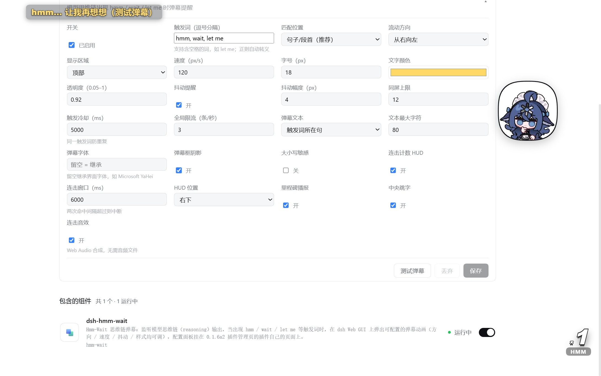

# dsh-hmm-wait — 思维链弹幕插件

> **English**: A DSH plugin that taps the model's streaming reasoning and flies configurable danmaku across the web GUI whenever it says "hmm", "wait" or "let me".


推理模型"想事情"的那几十秒里，界面上是**空的** —— 你只能干等。这个插件把那段空白变成动静：
模型思维链（reasoning）里一出现 `hmm` / `wait` / `let me`，GUI 上就飞过一条弹幕；
连续命中还会在角上堆起一个街机风的连击计数。


*效果实拍：左上角一条弹幕正在飞过（`hmm… 让我再想想`），右下角是连击计数 HUD（`×1 / HMM`）。这张是用配置卡片上的「**测试弹幕**」按钮触发的 —— 该按钮不需要模型参与，是插件自带的验证入口；飞过时的位置、速度、描边、抖动都按左侧那份配置生效。*

它给你三样东西：

| 你在界面上看到 | 什么时候出现 | 归谁管 |
| --- | --- | --- |
| **弹幕**飞过（默认右→左、顶部、黄字黑描边） | 思维链流里命中触发词，且过了句首 / 冷却 / 限流三道闸 | [触发词](#triggers) · [配置](#config) |
| 角上的 **Combo HUD**（`×N` 弹跳、分级变色、里程碑播报） | 连续命中：两次间隔 ≤ `comboWindowMs` 就连击 +1 | [配置](#config) |
| 一条**测试弹幕** | 你点配置卡片上的「测试弹幕」 | 不需要模型参与 |

**它不改变模型。** tap 挂在官方 `llm/stream` waterfall 上，是**观察者**：不改写 chunk、不吞 chunk，
自己的检测抛错也只吞自己（`src/index.ts:181-207`）。总开关关掉后 host 连监听都不挂，零开销。

### 一次命中在界面上是什么样（文字示意）

```
┌─ DSH Web GUI ───────────────────────────────────────────────┐
│                                                             │
│   hmm, wait — 这个报错看着不像网络问题…       ← 弹幕飞过      │
│   （触发词所在句，截断到 maxContextChars 字）                 │
│                                                             │
│                                              ┌───────────┐  │
│                                              │    ×3     │  │
│                                              │  COMBO    │  │
│                                              │   wait    │  │
│                                              │  BEST 7   │  │
│                                              └───────────┘  │
└─────────────────────────────────────────────────────────────┘
```

弹幕层是 `shell.overlay` 上的一层全屏 `fixed` 覆盖物（`pointer-events: none`），
**点击穿透**，不挡你操作；文字与位置全部来自设置快照，改一下立刻生效。

---

<a id="quickstart"></a>
## 快速开始

**前置条件**（先确认这三条，再动手）：

1. **dsh 已装好并能起 Web GUI**（`dsh` 在 PATH 上）。本插件是 dsh 插件，不是独立应用。
2. **Node ≥ 22.18**（或 ≥ 24.11）—— 出处：`package-lock.json` 里构建链的 `engines.node`
   （`tsdown@0.22.2` / `rolldown-plugin-dts` / `dts-resolver` 均为 `^22.18.0 || >=24.11.0`）。
   `package.json` **没有** `engines` 字段，所以这条不会被 npm 强制拦住，只会在构建时报错。
   *（本机 Node v24.12.0，`npm test` 实跑通过。）*
3. 装完 **host 半边要重挂插件**才生效；只改浏览器半边时刷新页面即可。

```bash
git clone https://github.com/liceses/dsh-hmm-wait.git && cd dsh-hmm-wait
npm install && npm run build
dsh plugin --profile web add link:$(pwd)
```

> **Windows**：最后一行把 `$(pwd)` 换成绝对路径，例如
> `dsh plugin --profile web add "link:D:\src\dsh-hmm-wait"`。
>
> **从 Release 的 tgz 装**：`dsh plugin --profile web add ./dsh-hmm-wait-0.1.0.tgz`（走 `file:` 依赖）。
>
> 装配细节（bundle patch / `dsh.client` 声明 / 卸载）见 [docs/ARCHITECTURE.md](docs/ARCHITECTURE.md)。

**跑起来之后你会看到**：侧栏 **「插件」→「已安装」→「查看 hmm-wait」**，
配置卡片**默认展开**（`defaultOpen`），字段就是下面[配置项一览](#config)那 25 个。

**先别急着发消息** —— 点卡片底部的 **「测试弹幕」**：host 会广播一条模拟弹幕，弹幕层立刻飞一条。
这一步不需要模型、不需要思维链，用来确认"装上了、链路是通的"。

确认通了，再给模型发一条需要"想一想"的任务；思维链里出现触发词时，弹幕就会飞。

---

<a id="toc"></a>
## 目录

| 想了解 | 看这里 |
| --- | --- |
| 它到底在听什么词、能不能自己加 | [触发词](#triggers) |
| 25 个配置字段的默认值与含义 | [配置项一览](#config) |
| 从流到屏幕的完整链路 | [工作原理（30 秒版）](#mechanism) |
| 哪个文件干什么 | [文件地图](#filemap) |
| 弹幕不出现怎么办 | [排障](#troubleshoot) |
| 有什么做不到的 | [已知限制](#limits) |
| 想改代码 | [开发](#dev) |
| 凭什么说它工作 | [验证记录](#evidence) |
| 许可证 | [许可](#license) |

---

<a id="triggers"></a>
## 触发词：它到底在听什么

默认三个触发词，都写在 `src/schema.ts` 的 `DEFAULT_CONFIG.triggers` 里：

| 触发词 | 类型 | 为什么是它 | 不会误命中 |
| --- | --- | --- | --- |
| `hmm` | 单词 | 英文思维链里最常见的"卡一下" | `shmmmer`（前面是字母） |
| `wait` | 单词 | 自我纠正的起手式 | `await`（前面是字母） |
| `let me` | **含空格的词组** | 重新规划的开场 | —— |

> 这三条不是"关键词表"，是**流式扫描**：chunk 把词切成两半也认得（`hm` + `m, let me check`
> 照样命中 `hmm`）。回归测试 R5a/R5b 就是盯这件事的。

### 判定规则（四道闸，按顺序）

| 闸 | 规则 | 源码 | 效果 |
| --- | --- | --- | --- |
| 1. 词边界 | `(?:^\|[^\p{L}\p{N}])(触发词)` | `src/detect.ts:46-48` | 前置不能是字母/数字 → `await` 不触发 `wait` |
| 2. 匹配位置 | `sentence-start`：触发词之前（自最近边界 `\n。！？!?；;` 起）只能有空白或引号；`anywhere`：任意位置 | `src/detect.ts:58-67` | 默认只认句首/段首，避免一句里到处乱弹 |
| 3. 冷却 | 同一触发词在 `cooldownMs` 内只弹一次 | `src/detect.ts:139-144` | 防流式 chunk 把同一个词重复触发 |
| 4. 限流 | `maxPerSecond` 每秒滑动窗口，全局限流 | `src/detect.ts:77-92` | 防思维链刷屏时弹幕炸屏 |

命中后还会**重置句子缓冲**，所以同一句不会弹第二次（`src/detect.ts:152`）。
另外每路 `llm/stream` 各建一个 detector 实例，句子状态不跨请求泄漏（`src/index.ts:188`）。

几个真实例子（都来自 `scripts/run-detector-tests.mjs` 的断言）：

| 思维链文本 | 命中？ | 为什么 |
| --- | --- | --- |
| `明白了。wait，我再想想` | ✅ `wait` | 句首 |
| `好的，注意 wait，我看看` | ❌ | 句中出现，默认模式不认 |
| `第一步完成。\nwait a second，好了` | ✅ `wait` | 换行也算句子边界 |
| `“wait，让我想想”` | ✅ `wait` | 句首只允许空白/引号，中文引号算引号 |
| `we await the result` | ❌ | 词边界挡住 |
| `注意 wait。然后` | ❌ | 边界在触发词**之后**，不算句首 |

### 能自己加吗？能，但只支持字面量

面板上有一行 **「触发词（逗号分隔）」** 输入框（`src/client/panel.tsx:217-225`）：

- 英文逗号 `,` 和中文逗号 `，` 都能当分隔符，两头空白会被去掉，空项忽略（`panel.tsx:54-59`）；
- 支持含空格的词组（`let me` 就是），所以能加 `hold on`、`等一下` 这类；
- **不支持正则**：每个触发词在编译前都会过 `escapeRegExp`（`src/detect.ts:38-40`），
  `.*` 进去就是字面的 `.*`。想写正则触发词得改源码 —— 见
  [docs/ARCHITECTURE.md](docs/ARCHITECTURE.md) §4.1（那里写了怎么把 `triggers` 的语义放开成正则片段）；
- 输入框清空后点保存会**回退成默认三个词**（`panel.tsx:143`），不会变成"没有触发词"。

> 中文触发词也能用：`嗯` 配 `sentence-start` 在 `好的，接下来。嗯，我想想` 上正常命中（测试 R13）。

---

<a id="config"></a>
## 配置项一览

全部 25 个字段，默认值来自 `src/schema.ts` 的 `DEFAULT_CONFIG`，面板标签与控件范围来自
`src/client/panel.tsx`。配置命名空间是 `dsh-hmm-wait`，host 侧注册为 `applies: 'live'`，
所以**保存即生效**，不用重启。

### 触发与节奏

| 字段 | 类型 | 默认 | 面板标签 | 说明 |
| --- | --- | --- | --- | --- |
| `enabled` | boolean | `true` | 开关 | 总开关。关掉后 host **卸掉** `llm/stream` 监听（不是空转），弹幕层也清屏 |
| `triggers` | string[] | `['hmm', 'wait', 'let me']` | 触发词（逗号分隔） | 只支持字面量，自动正则转义 |
| `match` | `sentence-start` \| `anywhere` | `sentence-start` | 匹配位置 | 默认只认句首/段首（推荐）；`anywhere` 认任意位置 |
| `caseSensitive` | boolean | `false` | 大小写敏感 | 关掉时 `Hmm` / `HMM` 也命中（只对英文触发词有意义） |
| `cooldownMs` | number | `5000` | 触发冷却（ms） | 同一触发词的防重复间隔；面板范围 500–120000 |
| `maxPerSecond` | number | `3` | 全局限流（条/秒） | 每秒最多推几条；面板范围 1–30 |

### 弹幕外观与动效

| 字段 | 类型 | 默认 | 面板标签 | 说明 |
| --- | --- | --- | --- | --- |
| `direction` | 4 枚举 | `right-to-left` | 流动方向 | `right-to-left` / `left-to-right` / `top-to-bottom` / `bottom-to-top` |
| `speed` | number | `120` | 速度（px/s） | 飞行时长 = 实际距离 ÷ speed；面板范围 20–600 |
| `zone` | `top` \| `bottom` \| `full` | `top` | 显示区域 | `top`/`bottom` 各占视口高度 40%，`full` 占 96% |
| `fontSize` | number | `18` | 字号（px） | 同时决定轨道行高（`fontSize × 1.7`）与轨道条数；面板范围 10–64 |
| `color` | string | `#ffd866` | 文字颜色 | CSS 颜色，面板是取色器 |
| `opacity` | number | `0.92` | 透明度 | 面板范围 0.05–1 |
| `shake` | boolean | `true` | 抖动提醒 | 出现瞬间左右抖一下，用来"一眼注意到" |
| `shakeIntensity` | number | `4` | 抖动幅度（px） | 面板范围 1–20；抖动时长随速度缩放（0.25–0.7s） |
| `maxOnScreen` | number | `12` | 同屏上限 | 超出时**挤掉最旧的**（`src/client/state.ts:84`）；面板范围 1–50 |
| `showContext` | boolean | `true` | 弹幕文本 | `触发词所在句` / `仅触发词` |
| `maxContextChars` | number | `80` | 文本最大字符 | 超出截断并加 `…`；面板范围 8–200 |
| `fontFamily` | string | `''`（空） | 弹幕字体 | 留空 = 用内置风格化字体栈 `'Arial Black', Impact, 'Segoe UI', 'Microsoft YaHei', sans-serif`（`danmaku.tsx:149-152`） |
| `shadow` | boolean | `true` | 弹幕框阴影 | 关掉 = 外阴影、黑描边、深色背景块**一起去掉**（`danmaku.tsx:154-159`） |

### Combo 连击 HUD

| 字段 | 类型 | 默认 | 面板标签 | 说明 |
| --- | --- | --- | --- | --- |
| `comboEnabled` | boolean | `true` | 连击计数 HUD | 连击 HUD 总开关 |
| `comboWindowMs` | number | `6000` | 连击窗口（ms） | 两次命中间隔超过它 → 连击中断；面板范围 1000–60000 |
| `comboPosition` | 4 枚举 | `bottom-right` | HUD 位置 | `bottom-right` / `bottom-left` / `top-right` / `top-left` |
| `comboMilestones` | boolean | `true` | 里程碑播报 | 连击达标后全屏播一句（文案见下） |
| `comboPop` | boolean | `true` | 中央跳字 | 每次连击更新，屏幕中央弹一下 `×N COMBO` |
| `comboSound` | boolean | `true` | 连击音效 | Web Audio 现场合成，**零音频文件**；浏览器未交互过时静默跳过 |

### Combo HUD 的具体表现

连击数由 **host 侧状态机**算（`src/combo.ts`），挂进程级根上下文，所以刷新页面、热重载、
重装插件都**不丢**；浏览器只负责画。

| 连击数 | 分级 | 颜色（深色主题 / 浅色主题） |
| --- | --- | --- |
| 1–4 | tier 1 | `#f2f2f2` / `#ffffff` |
| 5–9 | tier 2 | `#ffd866` / `#ffd93d` |
| 10–19 | tier 3 | `#ff9f43` |
| ≥ 20 | tier 4 | `#ff4d4f` / `#ff3b3b`（弹跳更快） |

里程碑文案（`src/client/combo.tsx:18-24`）：`10 热身完毕！` · `20 脑内风暴！` ·
`30 CPU 燃烧中！` · `50 模型宕机边缘！` · `100 AI の 沉思极限！`

> **一个要说清楚的实现细节**：代码是「连击数 ≥ 某档阈值就播报，文案取已达到的最高档」，
> 不是「只在 10 的倍数播报」——`combo.tsx:17` 的注释与
> [docs/ARCHITECTURE.md](docs/ARCHITECTURE.md) §2.3 的"×10/×20/…"都写得比实际严格。
> 行为以 `milestoneText()`（同文件 35-41 行）为准。

---

<a id="mechanism"></a>
## 工作原理（30 秒版）

一句话：**它监听模型流式输出里的 `reasoning-delta` 分片，扫触发词，命中就把一条事件推给所有打开的页面，页面负责画。**

```
模型流式输出（dsh-llm 的 llm/stream waterfall）
        │
        │  chunk: { type: 'reasoning-delta', index, text }
        ▼
┌───────────────────────────────────────────────────────────────┐
│ host 半边（node 进程）                                         │
│                                                               │
│  观察者 tap ── 逐 chunk 原样透传，顺手扫 reasoning-delta        │
│       │                                                       │
│       ├─ 每路流一个 Detector（句子状态互不污染）                 │
│       │    ├─ 词边界  (?:^|[^\p{L}\p{N}])(触发词)              │
│       │    ├─ 句首判定 sentence-start / anywhere                │
│       │    ├─ 冷却    同一触发词 cooldownMs 内只弹一次           │
│       │    └─ 限流    maxPerSecond 每秒滑动窗口                 │
│       │                    │ 命中                             │
│       │                    ▼                                  │
│       ├─ Combo 状态机（挂 ctx.root，进程级，热重载不丢）          │
│       │                    │ DanmakuEvent { id, ts, trigger,   │
│       │                    │               text, combo,        │
│       │                    ▼               comboMax, sessionId}│
│       └─ SSE Hub（环形缓冲最近 50 条；新连接立即补发）            │
│                            │                                  │
│  webServer 路由：GET /api/dsh-hmm-wait/events   （SSE 订阅）     │
│                  GET /api/dsh-hmm-wait/stats    （诊断）        │
│                  POST /api/dsh-hmm-wait/test    （测试弹幕）     │
└────────────────────────────┬──────────────────────────────────┘
                             │ SSE: event: danmaku / ping
                             ▼
┌───────────────────────────────────────────────────────────────┐
│ 浏览器半边（dsh Web GUI）                                      │
│  shell.overlay（全屏 fixed、点击穿透）                          │
│    ├─ 弹幕层：按 id 分轨道 → Web Animations 飞行 → 抖动          │
│    └─ Combo HUD：×N 弹跳 / 分级变色 / 里程碑 / COMBO END        │
└───────────────────────────────────────────────────────────────┘
```

四件事值得单独说：

- **事件源**：`llm/stream` 是 dsh-llm 的官方 waterfall 事件，每次流式调用都会走
  `ctx.waterfall(llm, 'llm/stream', options, next)`，监听器签名 `(options, next) => stream`。
  本插件返回的是 `next()` 的包装流，逐 chunk `yield` 原样透传，检测逻辑全在 `try/catch` 里。
  chunk 形状只做**鸭子类型判断**（`type === 'reasoning-delta'` 且 `text` 是字符串），
  不 import dsh-llm 的运行时符号。
- **推送**：SSE（不是 EventSource，用 `fetch` + `ReadableStream` 手解帧，兼容性更好）。
  断线 **1s 重连**；45s 收不到任何数据（含 30s 心跳 ping）判定半开、主动掐断重连；
  页面从后台回前台立即查一次。重连时 host 会把环形缓冲里的最近 50 条补发，
  客户端按事件 id 去重（保留最近 500 个 id），所以不会重复弹。
- **配置**：host 注册 `dsh-hmm-wait` settings 命名空间（schemastery schema，`applies: 'live'`）；
  浏览器半边 `ctx.settingsScope.bind({ namespace })` 订阅，把快照镜像进模块 store，
  弹幕层与 HUD 通过 `useSyncExternalStore` 消费。**弹幕订阅与配置镜像解耦** ——
  配置链路卡住也不会导致"页面活着但弹幕全无"。
- **连击在 host 算**：`DanmakuEvent` 自带 `combo` / `comboMax`，浏览器纯渲染。
  所以连击状态跨刷新、跨重连、跨插件热重载都在。

---

<a id="filemap"></a>
## 文件地图

| 路径 | 作用 |
| --- | --- |
| `src/index.ts` | host 入口：settings 注册 + `llm/stream` tap（可动态挂/卸）+ 三条路由 |
| `src/schema.ts` | 配置类型 + `DEFAULT_CONFIG` + 命名空间常量（host/client 共享，**零依赖**） |
| `src/schema-def.ts` | schemastery schema（**只给 host**，避免 schemastery 被打进浏览器 bundle） |
| `src/detect.ts` | 流式触发检测器：词边界 / 句首判定 / 冷却 / 限流。纯函数、无依赖、可单测 |
| `src/combo.ts` | 连击状态机。纯逻辑、可单测 |
| `src/protocol.ts` | SSE 协议：`DanmakuEvent` 形状、三条路径、帧编码（host/client 共享） |
| `src/routes.ts` | SSE hub（订阅集合 + 心跳 + 最近 50 条环形缓冲）+ events / stats / test 路由 |
| `src/client/index.tsx` | 浏览器入口：注入 CSS、镜像配置、注册三个槽位 |
| `src/client/danmaku.tsx` | 弹幕层：轨道分配、按方向/视口算飞行距离、抖动 |
| `src/client/combo.tsx` | 街机风 Combo HUD：弹跳、分级变色、里程碑、COMBO END |
| `src/client/panel.tsx` | 配置卡片（25 个字段，编辑先暂存 → 保存/丢弃） |
| `src/client/api.ts` | SSE 订阅（1s 重连 + 45s 半开看门狗）+ 测试弹幕调用 |
| `src/client/state.ts` | 模块级 store：弹幕队列、combo 快照、配置快照（`useSyncExternalStore`） |
| `src/client/audio.ts` | 街机合成音效（hit / milestone / break），Web Audio，零音频文件 |
| `src/client/styles.ts` | 注入页面的 CSS（抖动 keyframes + 卡片 + HUD，深浅主题双色板） |
| `src/vendor/dsh-plugin-config-slot.tsx` | 配置面板注册适配层（逐字内置，见迁移文档） |
| `cordis.patch.yml` | bundle patch：向 profile roster 插入 `id: hmm-wait` 一行 |
| `tsdown.config.ts` | 双产物构建：host ESM + client CJS（`__ModuleLoader__` 包裹） |
| `scripts/run-detector-tests.mjs` | 检测器回归测试（18 条断言，R1–R15） |
| `scripts/build.sh` | 构建入口（bash，dsh 插件工具链兼容） |
| `docs/ARCHITECTURE.md` | 开发文档：包结构、运行架构、装配、扩展指南、故障排查 |
| `docs/dsh-0.1.6a2-plugin-config-panel-migration.md` | 0.1.6a2 面板挂载点迁移的定位与实机验证记录 |

### 它长在哪（座位表）

| 面 | 槽位 | 说明 |
| --- | --- | --- |
| 弹幕层 | `shell.overlay`（list, root, order 100） | 全屏 fixed、点击穿透 |
| Combo HUD | `shell.overlay`（list, root, order 120） | 同一层的第二个条目，位置四角可配 |
| 配置面板 | `plugins.bundle.config`（keyed, key=`dsh-hmm-wait`） | dsh **0.1.6a2 统一插件管理页**里本插件自己的页面（侧栏「插件」→「查看 hmm-wait」）；rc7 时代的 `settings.plugin.item` 槽位在 0.1.6a2 已被移除 |

---

<a id="troubleshoot"></a>
## 排障

<details>
<summary><b>面板里找不到 Hmm-Wait 卡片</b></summary>

host 没装配上这一行。查两处：

```bash
dsh plugin --profile web ls          # 确认 hmm-wait 行存在
```

以及 `cordis.patch.yml` 是否被当作 profile bundle 层应用（它通过 `package.json` 的
`dsh.bundle.patch` 字段生效）。装完 host 半边**必须重挂插件**，只刷新页面没用。
</details>

<details>
<summary><b>测试弹幕正常，但真实对话里一条弹幕都没有</b></summary>

测试弹幕走的是 POST 路由，绕过了检测器 —— 它只证明"SSE 链路通"。真实弹幕不出现，按顺序查：

1. **模型有没有吐 reasoning？** 非推理模型（或关闭了思考）根本没有 `reasoning-delta` chunk，
   检测器拿不到输入。换个会输出思维链的模型试。
2. **触发词是不是在句首？** 默认 `sentence-start` 只认句首/段首。
   临时把「匹配位置」改成 `anywhere` 验证一下。
3. **冷却与限流是不是压住了？** `cooldownMs` 默认 5000、`maxPerSecond` 默认 3。
4. **触发词是不是被词边界挡了？** `await` 不会命中 `wait`。
</details>

<details>
<summary><b>连测试弹幕都不出现</b></summary>

SSE 订阅失败。打开浏览器 DevTools → Network，看 `events` 请求：

```bash
curl http://127.0.0.1:19387/api/dsh-hmm-wait/stats
# {"ok":true,"subscribers":1,"connections":[…],"events":N,"ts":…}
```

`subscribers` 是 0 → 页面的 SSE 没连上（路由没注册，或代理吞了流式响应）。
`events` 一直是 0 → host 根本没广播（tap 没装上，或 `enabled` 是关的）。
</details>

<details>
<summary><b>改了配置没反应</b></summary>

- 卡片是**编辑先暂存**的：改完必须点 **「保存」**（顶部会出现「未保存」徽章）。
  点「丢弃」会还原。
- 确认 host 侧 `ctx.settings.register` 成功（同一命名空间重复注册会报错）。
- 浏览器半边只刷新页面即可；host 半边改动要重挂插件。
</details>

<details>
<summary><b>和别的插件（比如重试类）一起用会不会打架</b></summary>

不会。tap 是观察者，多个监听器可以叠加；重试会重新触发流，冷却机制兜底。
</details>

---

<a id="limits"></a>
## 已知限制

- **只对"会输出思维链的模型"有意义。** 非推理模型、或把 thinking 关掉的会话里，
  `reasoning-delta` 不存在，本插件就只是"装了个安静的面板"。
- **只认字面量触发词。** 正则触发词要改源码（`src/detect.ts` 的 `escapeRegExp`），
  面板做不到。
- **只监听 `reasoning-delta`。** 最终回答正文里的 `hmm` 不会触发 —— 这是设计：
  弹幕的意义是"模型正在想"，正文阶段已经想完了。想加别的源（比如工具调用开始）见
  [docs/ARCHITECTURE.md](docs/ARCHITECTURE.md) §4.3。
- **`package.json` 没有 `engines` 字段。** 所以 Node 版本要求只写在文档里，
  npm 不会拦住低版本 Node；真正的约束来自构建链（见[快速开始](#quickstart)）。
- **peer 范围是 `^0.1.0-rc.7`**（= `>=0.1.0-rc.7` 且 `<0.2.0`）。0.1.x 内升级不用管；
  跨到 0.2 时 npm 会提示 peer 不匹配 —— 但插件运行时的依赖全部从宿主解析，
  不会因此装出第二份实例。
- **Electron / `file://` 形态下 SSE 是否可用取决于 client-connection 桥**
  （[docs/ARCHITECTURE.md](docs/ARCHITECTURE.md) §6 的仓库自述）。桥不支持流式时，
  功能**静默降级**：面板与配置照常，只是没有弹幕。
- **音效可能被浏览器自动播放策略拦掉。** Web Audio 需要用户交互过（sticky activation）才能
  `resume()`；被拦时静默跳过，不影响其他功能。
- **弹幕文本是思维链原文的片段。** 它会在屏幕上显示模型思考时的那句话
  （截断到 `maxContextChars`）。介意的话把「弹幕文本」改成 `仅触发词`。
- **动画依赖 Web Animations API**（`element.animate`），极老的浏览器内核不支持。

---

<a id="dev"></a>
## 开发

```bash
npm run typecheck   # tsc --noEmit（strict）
npm test            # 检测器回归测试（18 条断言，R1–R15）
npm run build       # tsc 出 d.ts + tsdown 出双 bundle（lib/index.js + lib/client.js）
npm pack            # 产出可分发 tgz（files: lib/ + src/ + cordis.patch.yml）
bash scripts/build.sh   # 等价入口（typecheck + build）
```

测试怎么跑起来的：`scripts/run-detector-tests.mjs` **直接 `import '../src/detect.ts'`**，
不预先编译（靠 Node 的原生类型剥离），所以改完 `detect.ts` 立刻 `npm test` 就能看到结果。
断言覆盖：边界在触发词之后、句中不命中、句首/换行/引号句首、流式拆词、中文句子后的英文句首、
`anywhere` 模式、`await` 不误命中、同句双词只弹一次、冷却、限流、中文触发词、超长流防膨胀、缩进段首。

三个扩展点（细节见 [docs/ARCHITECTURE.md](docs/ARCHITECTURE.md) §4）：

| 想改什么 | 动哪里 |
| --- | --- |
| 触发词算法（同义词库 / 放开正则） | `src/detect.ts`（`escapeRegExp` 处放开）+ 补 `run-detector-tests.mjs` 断言 |
| 弹幕动效（新方向 / 新轨道策略） | `src/client/danmaku.tsx` 的 `flight()` / `placement` + `src/schema.ts` 的方向枚举 + schema union + `panel.tsx` 加控件 |
| 新事件源（比如工具调用也弹幕） | `src/index.ts` 再加一个 `ctx.on(...)`，命中后走同一个 `hub.broadcast`；要区分来源就给 `DanmakuEvent` 加 `kind` |

**浏览器半边的纪律**：`src/client/**` 不能 import `schema-def.ts`（会把 schemastery 打进
浏览器 bundle）。配置类型与默认值从 `schema.ts` 拿，schema 本体留在 host 侧。

**热重载边界**：SSE hub 与 combo 状态机挂在 `ctx.root` 上（`APP_HUB_KEY` / `APP_COMBO_KEY`），
所以插件重装时**已订阅的页面不会断、连击也不会归零**；路由与样式跟随 fiber 的 `ctx.effect` 拆除。
`docs/ARCHITECTURE.md` §2.3 有卸载命令。

---

<a id="evidence"></a>
## 验证记录

| 事项 | 状态 | 出处 |
| --- | --- | --- |
| 检测器回归测试 18 条断言 | **本机实跑通过**（Node v24.12.0，`npm test` → `ALL PASS`） | `scripts/run-detector-tests.mjs` |
| 0.1.6a2 统一插件管理后配置面板正常渲染、字段与 `~/.dsh/settings.yaml` 一致 | **仓库内记录的实机验证**（记录时间 2026-09-18，环境 `@deepseek-ai/dsh@0.1.6-alpha.2`，profile `web`） | [docs/dsh-0.1.6a2-plugin-config-panel-migration.md](docs/dsh-0.1.6a2-plugin-config-panel-migration.md) §三 |
| 0.1.6a2 的挂载点迁移根因（`settings.plugin.item` → `plugins.bundle.config`，键从命名空间换成组合包名） | 同一次定位的结论，含受影响插件全量清点 | 同上 §一 |
| 弹幕动效、Combo HUD 的观感 | **未在本机重跑带 reasoning 的真实对话去逐条核对** | —— |

本文档里所有字段默认值、枚举取值、面板范围、判定规则**逐条对着源码写的**，
出处标在每张表旁边；命令全部来自仓库文件（`package.json` scripts、`cordis.patch.yml` 注释、
`docs/ARCHITECTURE.md`、`scripts/build.sh`）。

---

<a id="license"></a>
## 许可

BSD-3-Clause —— 声明见 [`package.json`](package.json) 的 `license` 字段。

> 仓库根目录**没有** `LICENSE` 文件（GitHub 因此识别不到许可证，`licenseInfo` 为 `null`）。
> 要不要补一个 `LICENSE` 文件、版权署名怎么写，得仓库主人定 —— 本次改写没有代加。

---

## 相关

- [docs/ARCHITECTURE.md](docs/ARCHITECTURE.md) —— 开发文档（包结构 / 运行架构 / 装配 / 扩展 / 排障）
- [docs/dsh-0.1.6a2-plugin-config-panel-migration.md](docs/dsh-0.1.6a2-plugin-config-panel-migration.md) —— 0.1.6a2 插件配置面板迁移记录
